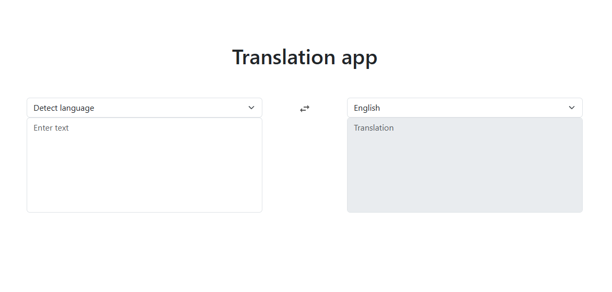

# Fast Translation App

A personalized translation app for users. It allows users to translate text between different languages.

  <a href="https://translation-ai-app.netlify.app/" target="_blank">
   
  </a>

# 📗 Table of Contents

- [📖 About the project](#about-project)
  - [🛠 Built with](#built-with)
    - [Tech stack](#tech-stack)
    - [Key features](#key-features)
  - [🚀 Live demo](#live-demo)
- [💻 Getting started](#getting-started)
  - [Setup](#setup)
  - [Prerequisites](#prerequisites)
  - [Install](#install)
  - [Usage](#usage)
  - [Run tests](#run-tests)
  - [Deployment](#deployment)
- [👷 Author](#author)
- [🔭 Future features](#future-features)
- [🤝 Contributing](#contributing)
- [⭐️ Show your support](#support)
- [🙏 Acknowledgements](#acknowledgements)
- [📝 License](#license)

# 📖 About the project 

This project is a translation app that allows users to translate text between different languages. It is designed to be user-friendly and efficient, providing a seamless experience for users who need quick translations.

OpenAI's GPT-4 model was used to power the translation functionality, serverless functions to handle the API requests, and Netlify for deployment.

The app is built using React and TypeScript, ensuring a modern and responsive design. The user interface is clean and intuitive, making it easy for users to input text and receive translations.

## 🛠 Built with 

### Tech stack 

  
Languages and technologies
 
  <ul>
    <li><a href="https://react.dev/">React.js</a></li>
    <li><a href="https://www.typescriptlang.org/">TypeScript</a></li>
    <li><a href="https://developer.mozilla.org/en-US/docs/Web/HTML">HTML</a></li>
    <li><a href="https://developer.mozilla.org/en-US/docs/Web/CSS">CSS</a></li>
    <li><a href="https://react-bootstrap.github.io/">React Bootstrap</a></li>
    <li><a href="https://git-scm.com/">Git</a></li>
    <li><a href="https://vitejs.dev/">Vite</a></li>
  </ul>

### Key features 

- **[Fast translation]**
- **[Minimalist design]**
- **[Multilanguage support]**

(<a href="#readme-top">back to top</a>)

## 🚀 Live demo 

- [Live Demo Link](https://translation-ai-app.netlify.app/)

(<a href="#readme-top">back to top</a>)

## 💻 Getting started 

To get a local copy up and running, follow these steps.

### Setup

Clone this repository to your desired folder:

`git clone` https://github.com/J-C-S-V/translation-app

### Install

`cd translation-app` 
This will navigate to the project directory.

`npm install` 
This will install all the necessary dependencies for the project.

### Usage

`npm run dev` 
This will start the development server and open the app in your default web browser.

### Run tests

Tests will be added in the future.

### Deployment

You can deploy this project using:

- [Netlify](https://www.netlify.com/) 
  It is recommended to use Netlify for deployment as it provides functions for serverless API requests.

(<a href="#readme-top">back to top</a>)

## 👷‍♂️ Author 

👷‍♂️ **Juan Sanchez**

- GitHub: [Juan Sanchez](https://github.com/J-C-S-V)
- Twitter: [Juan Sanchez](https://twitter.com/juansan0)
- LinkedIn: [Juan Sanchez](https://www.linkedin.com/in/sanchez-juan-carlos)

(<a href="#readme-top">back to top</a>)

## 🔭 Future features 

- [ ] **[Responsive design]**
- [ ] **[Text to speech]**
- [ ] **[Copy button]**

(<a href="#readme-top">back to top</a>)

## 🤝 Contributing 

Make this app better. Contributions, issues, and feature requests are welcome! 😀

Fork this repository and create a pull request to add your changes.

Feel free to check the [issues page](../../issues/).

(<a href="#readme-top">back to top</a>)

## ⭐️ Show your support 

If you get inspired by this project you can give a star to this project here on Github 🙌

(<a href="#readme-top">back to top</a>)

## 🙏 Acknowledgments 

I would like to thank Reaper for providing the audio engine for this project 🚀

(<a href="#readme-top">back to top</a>)

## 📝 License 

This project is [MIT](https://github.com/J-C-S-V/translation-app/blob/main/MIT.md) licensed.

(<a href="#readme-top">back to top</a>)

